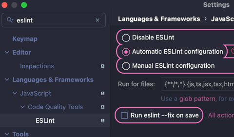
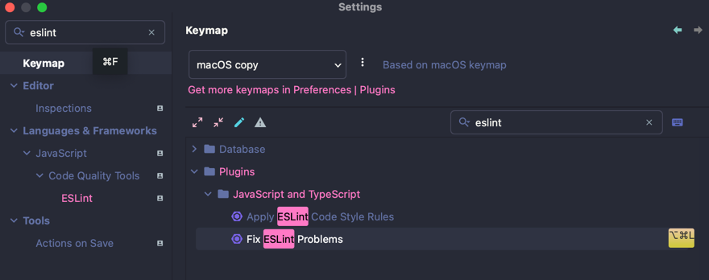
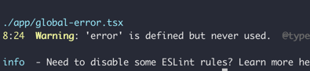
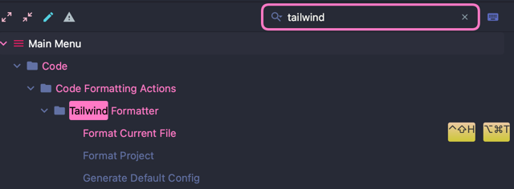
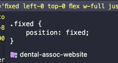
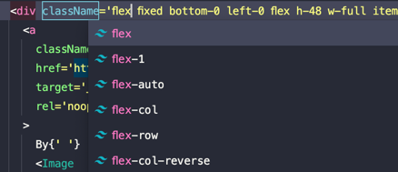
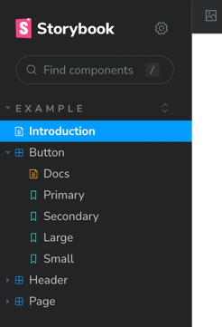
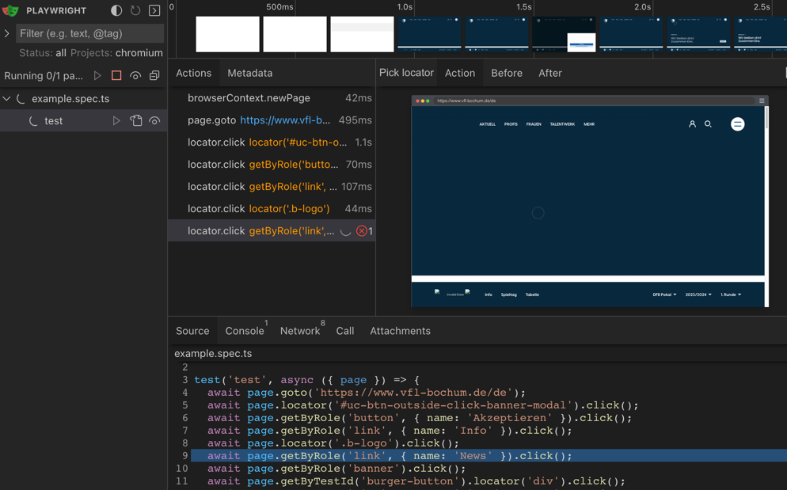
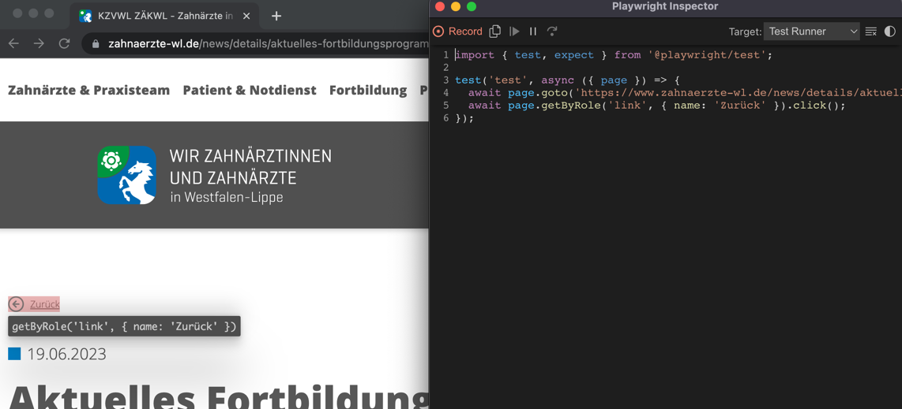

# Before you start !
Keep in mind that this project is based on Next.js 13 and will make heavy use of it's features. Please check the link at the bottom or google the necessary features directly to make yourself familiar before you start.

# Table of Contents
* [Building Blocks](#building-blocks)
* [Getting Started - Next.js](#getting-started---nextjs)
* [Code Quality - ESLint](#code-quality---eslint)
* [Code Quality - Tailwind](#code-quality---tailwind)
* [UI Development - Storybook](#ui-development---storybook)
* [Testing - Playwright](#testing---playwright)
* [Learn More](#learn-more)
* [Contribute](#contribute)

## Building Blocks
(Documentation links and versions as of initialization.)
* [React 18.2](https://react.dev/learn)
* [Next.js 13](https://nextjs.org/docs)
* [Typescript 5.1](https://www.typescriptlang.org/docs/)
* [Tailwind 3.3.2](https://tailwindcss.com/docs/installation)
* [Storybook 7](https://storybook.js.org/docs/react/get-started/install)
* [Playwright 1.3.5](https://playwright.dev/docs/intro)
* [Node 20.3.1](https://nodejs.org/de/docs)

## Getting Started - Next.js

First, run the development server:

```bash
npm run dev
```

Open [http://localhost:3000](http://localhost:3000) with your browser to see the result.

You can start editing the page by modifying `app/button.tsx`. The page auto-updates as you edit the file.

This project uses [`next/font`](https://nextjs.org/docs/basic-features/font-optimization) to automatically optimize and load Inter, a custom Google Font.

## Code Quality - ESLint
```bash
npm run lint
# or
npm run lint-fix
```
* Configure your ESLint in you Code Quality Tools. (preference, but useful: Run eslint --fix on save)\


* Setup a keybinding to 'Fix ESLint Problems' ! Use it frequently.\


* Make sure to use these commands before every commit and push to find and purge all errors and provide a coherent code base.\
* 

## Code Quality - Tailwind
Make sure to have following Plugins installed if you are on IntelliJ !
* Tailwind Formatter
  * className sorting - Tailwind is already ugly as it is, helps with readability
  * Make sure to adjust your Keymap and use it frequently.\
    

* Tailwind CSS
  * Preview of the resulting CSS for classes on hover and in the code completion popup)\
     

  * Intellisense for Tailwind CSS class names after @apply and in HTML\
    


## UI Development - Storybook
```bash
npm run storybook
```
Open https://localhost:6006 with your browser to open the _storybook_ Dashboard.

* Read the "Introduction" section to get an idea of how _storybook_ works.\


Here you will find all configured components with their different variations, props and documentation.
Make sure to document every component in here to also test their individual viability.


## Testing - Playwright
```bash
npm run pw-test
#or
npm run pw-codegen
```
* Make sure to regularly run these tests (should eventually run in CI). 
This will open the _playwright_ browser UI with all the necessary information and data.\

* Codegeneration is helpful to 'record' a click order to test and verify simple user interaction. This is **not** however a replacement for proper test writing.\


## Learn More

To learn more about Next.js, take a look at the following resources:

- [Next.js Documentation](https://nextjs.org/docs) - learn about Next.js features and API.
- [Learn Next.js](https://nextjs.org/learn) - an interactive Next.js tutorial.

You can check out [the Next.js GitHub repository](https://github.com/vercel/next.js/) - your feedback and contributions are welcome!

# Contribute
TODO: Explain how other users and developers can contribute to make your code better.

If you want to learn more about creating good readme files then refer the following [guidelines](https://docs.microsoft.com/en-us/azure/devops/repos/git/create-a-readme?view=azure-devops). You can also seek inspiration from the below readme files:
- [ASP.NET Core](https://github.com/aspnet/Home)
- [Visual Studio Code](https://github.com/Microsoft/vscode)
- [Chakra Core](https://github.com/Microsoft/ChakraCore)
